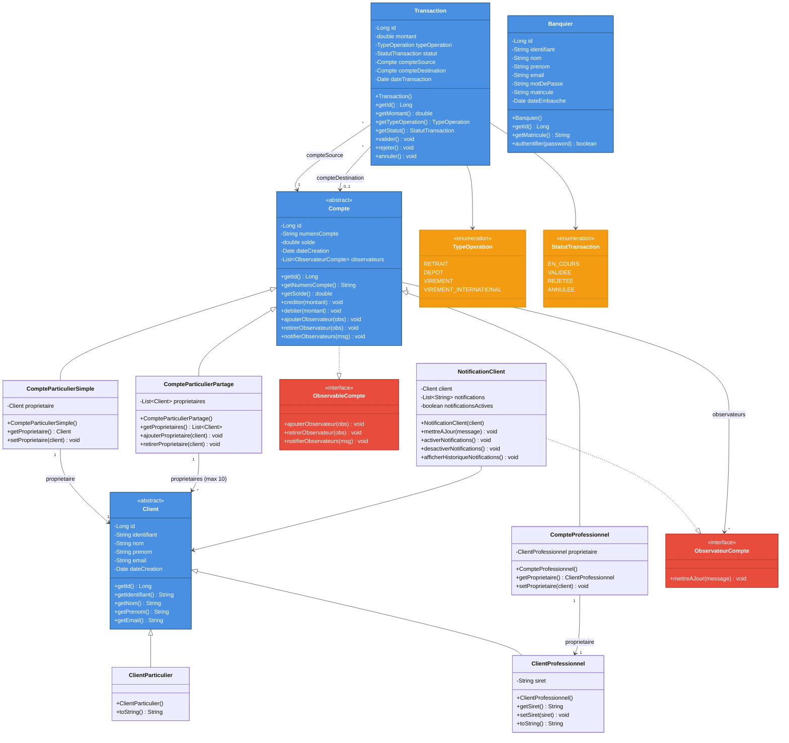
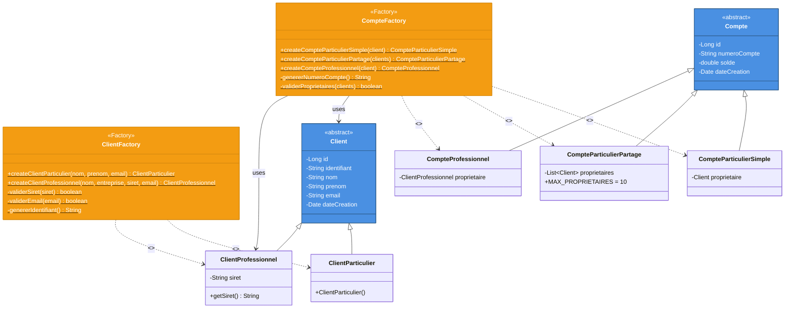
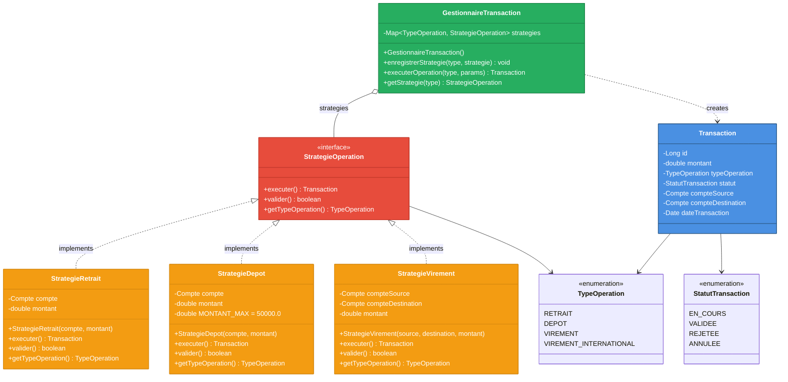
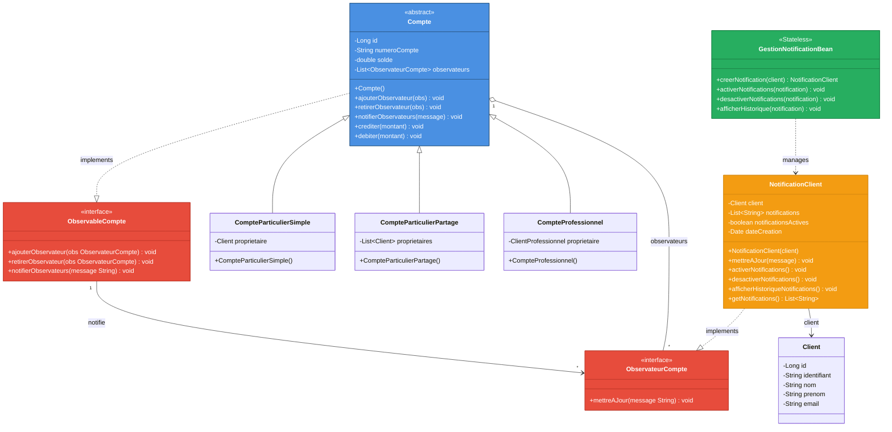
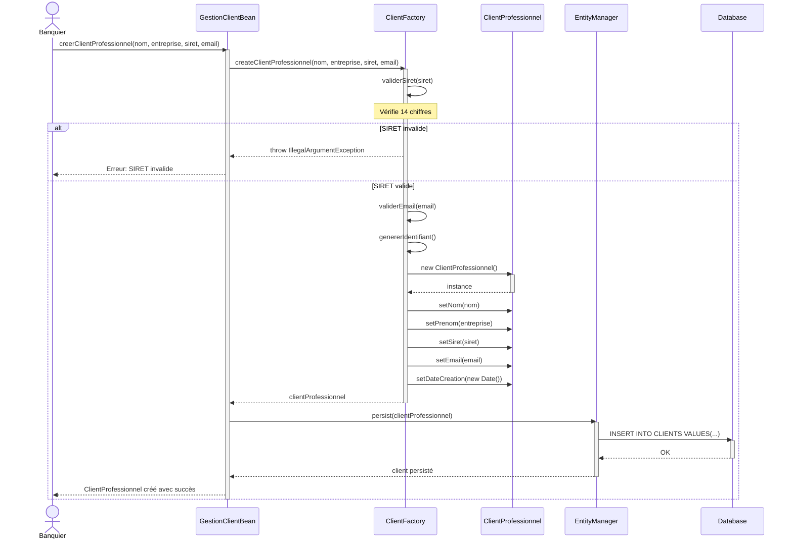
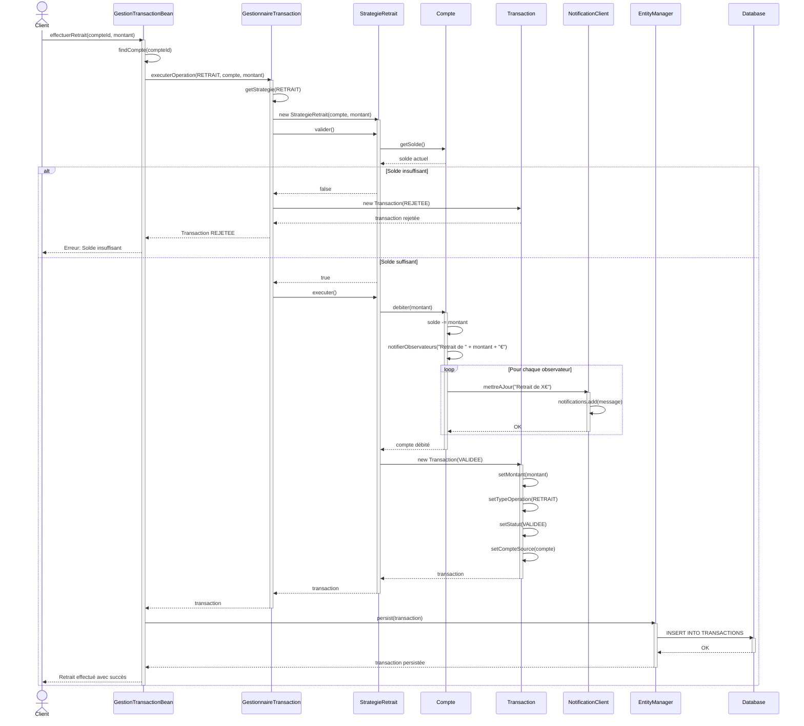
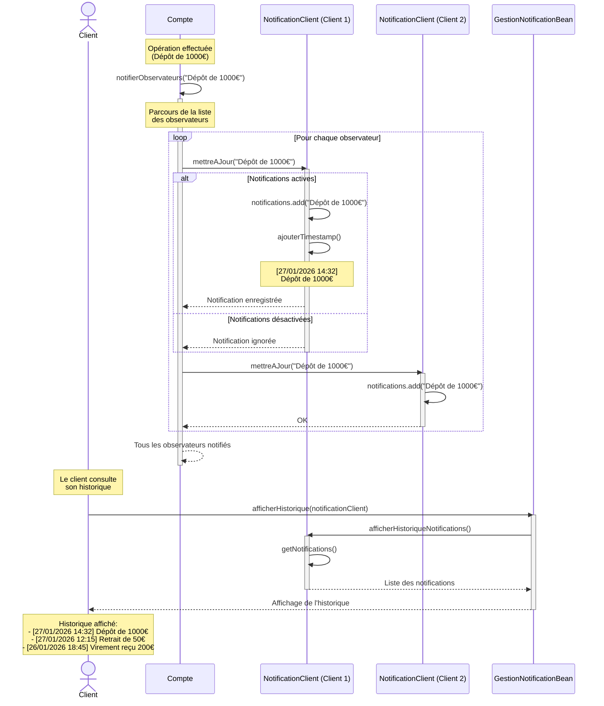
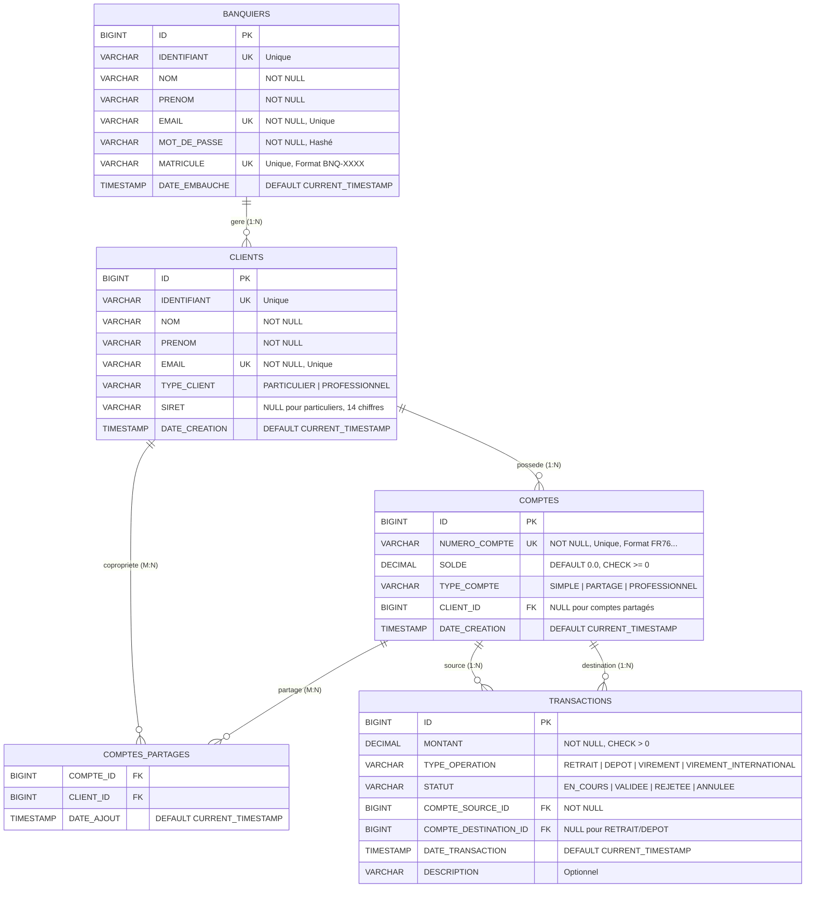
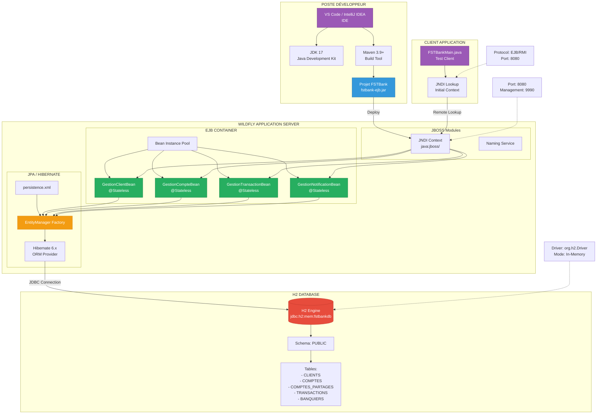

# 📊 DIAGRAMMES UML - PROJET FSTBANK

## Application de Gestion Bancaire - Architecture EJB3 3-TIERS

---

## 📑 TABLE DES MATIÈRES

1. [Diagramme de Classes - Entités](#1-diagramme-de-classes---entités)
2. [Diagramme d'Architecture 3-Tiers](#2-diagramme-darchitecture-3-tiers)
3. [Diagramme Factory Pattern](#3-diagramme-factory-pattern)
4. [Diagramme Strategy Pattern](#4-diagramme-strategy-pattern)
5. [Diagramme Observer Pattern](#5-diagramme-observer-pattern)
6. [Diagramme de Séquence - Créer Client](#6-diagramme-de-séquence---créer-client)
7. [Diagramme de Séquence - Effectuer Retrait](#7-diagramme-de-séquence---effectuer-retrait)
8. [Diagramme de Séquence - Notification Client](#8-diagramme-de-séquence---notification-client)
9. [Diagramme Entité-Relation](#9-diagramme-entité-relation)
10. [Diagramme de Déploiement](#10-diagramme-de-déploiement)

---

## 1. DIAGRAMME DE CLASSES - ENTITÉS

### Description
Ce diagramme présente la structure complète des entités du système FSTBank, incluant les hiérarchies d'héritage pour les clients et les comptes, ainsi que les relations JPA entre les entités.



### Légende
- 🔵 **Bleu** : Classes entités (@Entity)
- 🔴 **Rouge** : Interfaces
- 🟠 **Orange** : Énumérations (Enums)
- **Flèches pleines** : Héritage
- **Flèches pointillées** : Implémentation d'interface
- **Flèches simples** : Associations JPA

---

## 2. DIAGRAMME D'ARCHITECTURE 3-TIERS

### Description
Ce diagramme illustre l'architecture complète de l'application FSTBank en trois couches distinctes : présentation, logique métier (EJB Session Beans), et persistance (JPA/H2).

```mermaid
graph TB
    subgraph "TIER 3 - PRESENTATION LAYER"
        CLIENT[FSTBankMain<br/>Test Client]
        REMOTE1["@Remote<br/>GestionClientRemote"]
        REMOTE2["@Remote<br/>GestionCompteRemote"]
        REMOTE3["@Remote<br/>GestionTransactionRemote"]
        REMOTE4["@Remote<br/>GestionNotificationRemote"]
    end

    subgraph "WILDFLY SERVER"
        subgraph "TIER 2 - BUSINESS LOGIC (EJB Container)"
            BEAN1["@Stateless<br/>GestionClientBean"]
            BEAN2["@Stateless<br/>GestionCompteBean"]
            BEAN3["@Stateless<br/>GestionTransactionBean"]
            BEAN4["@Stateless<br/>GestionNotificationBean"]
            
            subgraph "Design Patterns"
                FACTORY1[ClientFactory]
                FACTORY2[CompteFactory]
                MANAGER[GestionnaireTransaction<br/>Strategy Pattern]
            end
        end

        subgraph "JPA / HIBERNATE"
            EM[EntityManager]
            PERSISTENCE[persistence.xml]
        end
    end

    subgraph "TIER 1 - DATABASE LAYER"
        DB[(H2 Database<br/>jdbc:h2:mem:fstbankdb)]
        
        subgraph "Tables"
            T1[CLIENTS]
            T2[COMPTES]
            T3[COMPTES_PARTAGES]
            T4[TRANSACTIONS]
            T5[BANQUIERS]
        end
    end

    %% Connexions Tier 3 -> Tier 2
    CLIENT -->|JNDI Lookup| REMOTE1
    CLIENT -->|JNDI Lookup| REMOTE2
    CLIENT -->|JNDI Lookup| REMOTE3
    CLIENT -->|JNDI Lookup| REMOTE4

    REMOTE1 -.->|implements| BEAN1
    REMOTE2 -.->|implements| BEAN2
    REMOTE3 -.->|implements| BEAN3
    REMOTE4 -.->|implements| BEAN4

    %% Connexions Beans -> Patterns
    BEAN1 -->|uses| FACTORY1
    BEAN2 -->|uses| FACTORY2
    BEAN3 -->|uses| MANAGER

    %% Connexions Beans -> JPA
    BEAN1 -->|@PersistenceContext| EM
    BEAN2 -->|@PersistenceContext| EM
    BEAN3 -->|@PersistenceContext| EM
    BEAN4 -->|@PersistenceContext| EM

    EM -->|configured by| PERSISTENCE

    %% Connexions JPA -> Database
    EM -->|CRUD Operations| DB
    DB --> T1
    DB --> T2
    DB --> T3
    DB --> T4
    DB --> T5

    %% Styles
    style CLIENT fill:#9B59B6,stroke:#6C3483,color:#fff
    style BEAN1 fill:#27AE60,stroke:#1E8449,color:#fff
    style BEAN2 fill:#27AE60,stroke:#1E8449,color:#fff
    style BEAN3 fill:#27AE60,stroke:#1E8449,color:#fff
    style BEAN4 fill:#27AE60,stroke:#1E8449,color:#fff
    style FACTORY1 fill:#F39C12,stroke:#D68910,color:#fff
    style FACTORY2 fill:#F39C12,stroke:#D68910,color:#fff
    style MANAGER fill:#F39C12,stroke:#D68910,color:#fff
    style EM fill:#3498DB,stroke:#2471A3,color:#fff
    style DB fill:#E74C3C,stroke:#C0392B,color:#fff
```

### Composants clés

**TIER 3 - Présentation**
- FSTBankMain : Client de test utilisant JNDI pour accéder aux beans
- Interfaces @Remote : Contrats exposés pour l'accès distant

**TIER 2 - Logique Métier**
- 4 Session Beans @Stateless avec injection @PersistenceContext
- Design Patterns intégrés (Factory, Strategy, Observer)
- Gestion transactionnelle automatique (@TransactionAttribute)

**TIER 1 - Persistance**
- Base H2 en mémoire
- 5 tables relationnelles avec contraintes d'intégrité
- Gestion via JPA/Hibernate

---

## 3. DIAGRAMME FACTORY PATTERN

### Description
Le pattern Factory est utilisé pour créer les clients et les comptes avec validation métier intégrée (SIRET, limites, contraintes).



### Règles de validation

**ClientFactory**
- ✅ SIRET : exactement 14 chiffres
- ✅ Email : format valide (regex)
- ✅ Nom/Prénom : non vides
- ✅ Identifiant unique auto-généré

**CompteFactory**
- ✅ Numéro de compte unique (format: FR76 XXXX XXXX XXXX XXXX)
- ✅ Compte partagé : minimum 2, maximum 10 propriétaires
- ✅ Compte professionnel : uniquement pour ClientProfessionnel
- ✅ Solde initial : 0.0€

---

## 4. DIAGRAMME STRATEGY PATTERN

### Description
Le pattern Strategy permet de gérer différents types d'opérations bancaires (retrait, dépôt, virement) avec leurs propres règles de validation et d'exécution.



### Règles métier par stratégie

**StrategieRetrait**
- ✅ Vérifier solde suffisant
- ✅ Montant > 0
- ✅ Débiter le compte source
- ✅ Créer transaction avec statut VALIDEE ou REJETEE

**StrategieDepot**
- ✅ Montant > 0 et ≤ 50,000€ (limite anti-blanchiment)
- ✅ Créditer le compte
- ✅ Créer transaction VALIDEE

**StrategieVirement**
- ✅ Solde suffisant sur compte source
- ✅ Montant > 0
- ✅ Débiter source, créditer destination
- ✅ Transaction atomique (tout ou rien)

---

## 5. DIAGRAMME OBSERVER PATTERN

### Description
Le pattern Observer permet aux clients de recevoir des notifications en temps réel sur les opérations effectuées sur leurs comptes (dépôts, retraits, virements).



### Flux de notification

1. **Enregistrement** : Le client active les notifications via `GestionNotificationBean`
2. **Ajout observateur** : `NotificationClient` est ajouté à la liste des observateurs du compte
3. **Opération** : Une opération (retrait/dépôt/virement) est effectuée sur le compte
4. **Notification** : Le compte appelle `notifierObservateurs("Retrait de 100€")`
5. **Mise à jour** : Tous les observateurs reçoivent l'alerte via `mettreAJour()`
6. **Historique** : Les notifications sont stockées et consultables

---

## 6. DIAGRAMME DE SÉQUENCE - CRÉER CLIENT

### Description
Ce diagramme illustre le processus complet de création d'un client professionnel, incluant la validation du SIRET et la persistance en base de données.



### Étapes clés

1. **Demande** : Le banquier demande la création d'un client professionnel
2. **Validation SIRET** : La factory vérifie que le SIRET contient exactement 14 chiffres
3. **Validation Email** : Vérification du format email
4. **Génération ID** : Création d'un identifiant unique
5. **Instanciation** : Création de l'objet ClientProfessionnel
6. **Persistance** : Sauvegarde via EntityManager dans la base H2
7. **Confirmation** : Retour au banquier avec succès ou erreur

---

## 7. DIAGRAMME DE SÉQUENCE - EFFECTUER RETRAIT

### Description
Ce diagramme montre le flux complet d'un retrait bancaire, incluant la sélection de la stratégie, la validation, l'exécution, et la notification des observateurs.



### Flux décisionnel

**Validation (StrategieRetrait)**
- ✅ Montant > 0
- ✅ Solde ≥ montant
- ❌ Si échec → Transaction REJETEE

**Exécution**
- Débit du compte
- Création de la transaction
- Notification des observateurs

**Persistance**
- Sauvegarde de la transaction
- Mise à jour du solde en base

---

## 8. DIAGRAMME DE SÉQUENCE - NOTIFICATION CLIENT

### Description
Ce diagramme détaille le mécanisme de notification en temps réel lorsqu'une opération est effectuée sur un compte.



### Types de notifications

**Notifications automatiques**
- 💰 Dépôt effectué
- 💸 Retrait effectué
- 🔄 Virement reçu
- 🔄 Virement envoyé
- ⚠️ Solde bas (< 100€)
- ❌ Opération rejetée

**Gestion des notifications**
- `activerNotifications()` : Active les alertes
- `desactiverNotifications()` : Désactive temporairement
- `afficherHistoriqueNotifications()` : Consultation de l'historique
- Conservation illimitée dans la liste

---

## 9. DIAGRAMME ENTITÉ-RELATION

### Description
Ce diagramme ER montre la structure complète de la base de données H2 avec toutes les tables, colonnes, clés primaires/étrangères et contraintes d'intégrité.



### Contraintes et indexes

**CLIENTS**
- `PK_CLIENTS` : PRIMARY KEY (ID)
- `UK_CLIENT_IDENTIFIANT` : UNIQUE (IDENTIFIANT)
- `UK_CLIENT_EMAIL` : UNIQUE (EMAIL)
- `CHK_CLIENT_TYPE` : TYPE_CLIENT IN ('PARTICULIER', 'PROFESSIONNEL')
- `CHK_SIRET_LENGTH` : SIRET NULL OR LENGTH(SIRET) = 14
- `IDX_CLIENT_EMAIL` : INDEX (EMAIL)

**COMPTES**
- `PK_COMPTES` : PRIMARY KEY (ID)
- `UK_NUMERO_COMPTE` : UNIQUE (NUMERO_COMPTE)
- `CHK_SOLDE_POSITIF` : SOLDE >= 0
- `CHK_TYPE_COMPTE` : TYPE_COMPTE IN ('SIMPLE', 'PARTAGE', 'PROFESSIONNEL')
- `FK_COMPTE_CLIENT` : FOREIGN KEY (CLIENT_ID) REFERENCES CLIENTS(ID)
- `IDX_COMPTE_CLIENT` : INDEX (CLIENT_ID)

**COMPTES_PARTAGES**
- `PK_COMPTES_PARTAGES` : PRIMARY KEY (COMPTE_ID, CLIENT_ID)
- `FK_PARTAGE_COMPTE` : FOREIGN KEY (COMPTE_ID) REFERENCES COMPTES(ID) ON DELETE CASCADE
- `FK_PARTAGE_CLIENT` : FOREIGN KEY (CLIENT_ID) REFERENCES CLIENTS(ID) ON DELETE CASCADE
- `CHK_MAX_PROPRIETAIRES` : COUNT(*) per COMPTE_ID <= 10

**TRANSACTIONS**
- `PK_TRANSACTIONS` : PRIMARY KEY (ID)
- `CHK_MONTANT_POSITIF` : MONTANT > 0
- `CHK_TYPE_OPERATION` : TYPE_OPERATION IN ('RETRAIT', 'DEPOT', 'VIREMENT', 'VIREMENT_INTERNATIONAL')
- `CHK_STATUT` : STATUT IN ('EN_COURS', 'VALIDEE', 'REJETEE', 'ANNULEE')
- `FK_TRANSACTION_SOURCE` : FOREIGN KEY (COMPTE_SOURCE_ID) REFERENCES COMPTES(ID)
- `FK_TRANSACTION_DEST` : FOREIGN KEY (COMPTE_DESTINATION_ID) REFERENCES COMPTES(ID)
- `IDX_TRANSACTION_DATE` : INDEX (DATE_TRANSACTION)
- `IDX_TRANSACTION_SOURCE` : INDEX (COMPTE_SOURCE_ID)

**BANQUIERS**
- `PK_BANQUIERS` : PRIMARY KEY (ID)
- `UK_BANQUIER_IDENTIFIANT` : UNIQUE (IDENTIFIANT)
- `UK_BANQUIER_EMAIL` : UNIQUE (EMAIL)
- `UK_BANQUIER_MATRICULE` : UNIQUE (MATRICULE)

---

## 10. DIAGRAMME DE DÉPLOIEMENT

### Description
Ce diagramme illustre l'infrastructure technique et le déploiement de l'application FSTBank sur WildFly avec la base H2.



### Configuration technique

**Environnement de développement**
- **IDE** : VS Code avec Extension Pack for Java / IntelliJ IDEA Ultimate
- **JDK** : OpenJDK 17 LTS
- **Build** : Maven 3.9+
- **Git** : Gestion de version

**WildFly Application Server (v27+)**
- **Ports** :
  - 8080 : HTTP (application)
  - 9990 : Management Console
  - 8009 : AJP Connector
- **Modules** :
  - EJB 3.2+ Container
  - JPA 2.2 / Hibernate 6.x
  - CDI 2.0
  - Bean Validation 2.0
- **Configuration** : standalone.xml
- **Déploiement** : Hot deploy via /deployments ou Management CLI

**H2 Database**
- **Mode** : In-Memory (jdbc:h2:mem:fstbankdb)
- **Alternative** : File-based (jdbc:h2:file:./data/fstbank)
- **Console** : http://localhost:8082 (H2 Console activable)
- **Persistance** : Optionnelle via fichier .mv.db

**Persistence (persistence.xml)**
```xml
<persistence-unit name="fstbank-pu">
    <jta-data-source>java:jboss/datasources/FSTBankDS</jta-data-source>
    <properties>
        <property name="hibernate.hbm2ddl.auto" value="create-drop"/>
        <property name="hibernate.show_sql" value="true"/>
        <property name="hibernate.format_sql" value="true"/>
    </properties>
</persistence-unit>
```

---

## 📚 RÉSUMÉ DES DESIGN PATTERNS

### 1. Factory Pattern
**Objectif** : Centraliser la création d'objets complexes avec validation métier
- `ClientFactory` : Valide SIRET, email, génère identifiants
- `CompteFactory` : Génère numéros de compte, valide propriétaires

### 2. Strategy Pattern
**Objectif** : Encapsuler différents algorithmes d'opérations bancaires
- `StrategieRetrait` : Validation solde + débit
- `StrategieDepot` : Limite 50k€ + crédit
- `StrategieVirement` : Transaction atomique source→destination

### 3. Observer Pattern
**Objectif** : Notifier les clients en temps réel des opérations sur leurs comptes
- `ObservableCompte` : Interface pour les sujets observés
- `ObservateurCompte` : Interface pour les observateurs
- `NotificationClient` : Implémentation concrète avec historique

---

## 🎨 LÉGENDE GÉNÉRALE

### Couleurs
- 🔵 **Bleu (#4A90E2)** : Classes entités (@Entity)
- 🟢 **Vert (#27AE60)** : Session Beans (@Stateless)
- 🟠 **Orange (#F39C12)** : Design Patterns (Factory, Strategy)
- 🔴 **Rouge (#E74C3C)** : Interfaces
- 🟣 **Violet (#9B59B6)** : Clients / Présentation

### Symboles UML
- **→** : Association (relation simple)
- **◆→** : Composition (contient, cycle de vie lié)
- **◇→** : Agrégation (contient, cycle de vie indépendant)
- **--|>** : Héritage (extends)
- **..|>** : Implémentation (implements)
- **- -** : Dépendance (uses)

### Annotations JPA
- `@Entity` : Classe persistante
- `@OneToMany` : Relation 1 à plusieurs
- `@ManyToMany` : Relation plusieurs à plusieurs
- `@ManyToOne` : Relation plusieurs à 1
- `@JoinTable` : Table de jointure

---

## 📋 CHECKLIST DE VALIDATION

### ✅ Architecture
- [x] Architecture 3-tiers clairement séparée
- [x] Session Beans @Stateless avec @Remote interfaces
- [x] Entités JPA avec relations correctes
- [x] Base de données H2 configurée

### ✅ Design Patterns
- [x] Factory Pattern : ClientFactory + CompteFactory
- [x] Strategy Pattern : GestionnaireTransaction + 3 stratégies
- [x] Observer Pattern : Compte observable + NotificationClient

### ✅ Fonctionnalités métier
- [x] Gestion clients (particuliers + professionnels)
- [x] Gestion comptes (simples + partagés + professionnels)
- [x] Gestion transactions (retrait + dépôt + virement)
- [x] Système de notifications en temps réel

### ✅ Qualité du code
- [x] Validation métier (SIRET, email, solde)
- [x] Gestion des erreurs (exceptions métier)
- [x] Transactions JPA (@Transactional)
- [x] Tests d'intégration (FSTBankMain)

---

## 📖 DOCUMENTATION TECHNIQUE

### Technologies utilisées
- **Java** : JDK 17 LTS
- **Jakarta EE** : EJB 3.2, JPA 2.2
- **Serveur** : WildFly 27+
- **ORM** : Hibernate 6.x
- **Base de données** : H2 Database (in-memory)
- **Build** : Maven 3.9+

### Structure du projet
```
fstbank/
├── src/main/java/
│   ├── entities/
│   │   ├── Client.java (abstract)
│   │   ├── ClientParticulier.java
│   │   ├── ClientProfessionnel.java
│   │   ├── Compte.java (abstract)
│   │   ├── CompteParticulierSimple.java
│   │   ├── CompteParticulierPartage.java
│   │   ├── CompteProfessionnel.java
│   │   ├── Transaction.java
│   │   └── Banquier.java
│   ├── session/
│   │   ├── GestionClientBean.java
│   │   ├── GestionCompteBean.java
│   │   ├── GestionTransactionBean.java
│   │   └── GestionNotificationBean.java
│   ├── remote/
│   │   ├── GestionClientRemote.java
│   │   ├── GestionCompteRemote.java
│   │   ├── GestionTransactionRemote.java
│   │   └── GestionNotificationRemote.java
│   ├── factories/
│   │   ├── ClientFactory.java
│   │   └── CompteFactory.java
│   ├── strategies/
│   │   ├── StrategieOperation.java
│   │   ├── StrategieRetrait.java
│   │   ├── StrategieDepot.java
│   │   ├── StrategieVirement.java
│   │   └── GestionnaireTransaction.java
│   └── observers/
│       ├── ObservableCompte.java
│       ├── ObservateurCompte.java
│       └── NotificationClient.java
├── src/main/resources/
│   └── META-INF/
│       └── persistence.xml
├── src/test/java/
│   └── FSTBankMain.java
└── pom.xml
```

---

## 🚀 COMMANDES DE DÉPLOIEMENT

### Build du projet
```bash
mvn clean package
```

### Déploiement sur WildFly
```bash
# Démarrer WildFly
cd $WILDFLY_HOME/bin
./standalone.sh

# Déployer l'application
cp target/fstbank-ejb.jar $WILDFLY_HOME/standalone/deployments/
```

### Accès à l'application
```bash
# Console Management
http://localhost:9990

# H2 Console (si activée)
http://localhost:8082
```

### Exécution du client de test
```bash
mvn exec:java -Dexec.mainClass="test.FSTBankMain"
```

---

## 📞 SUPPORT

Pour toute question sur l'architecture ou l'implémentation :
- Consulter la documentation Jakarta EE : https://jakarta.ee/
- Documentation WildFly : https://docs.wildfly.org/
- Documentation Hibernate : https://hibernate.org/orm/documentation/

---

**Document généré le 27 janvier 2026**  
**Version** : 1.0  
**Projet** : FSTBank - Application de gestion bancaire  
**Architecture** : EJB3 3-Tiers avec Design Patterns
